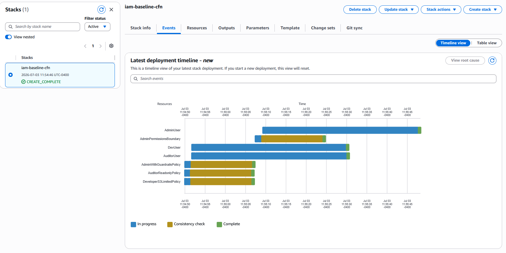
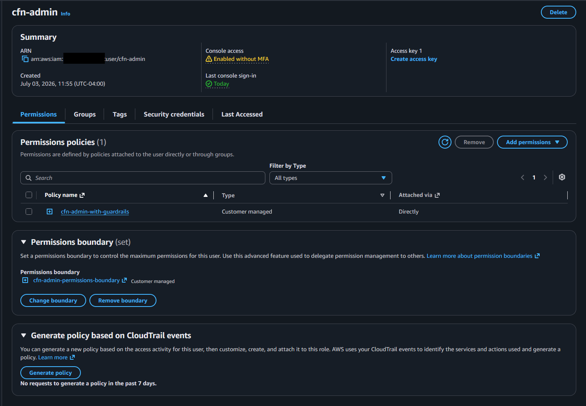
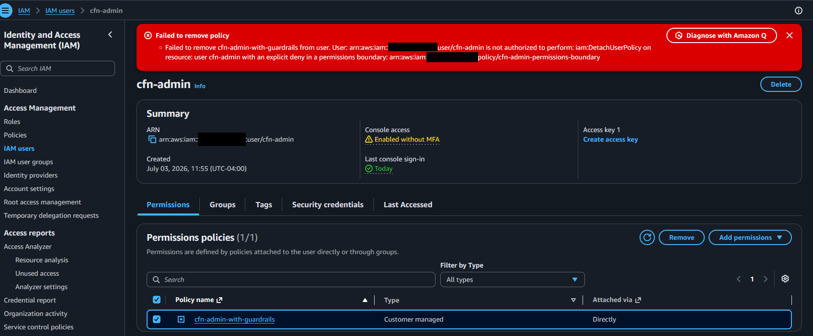
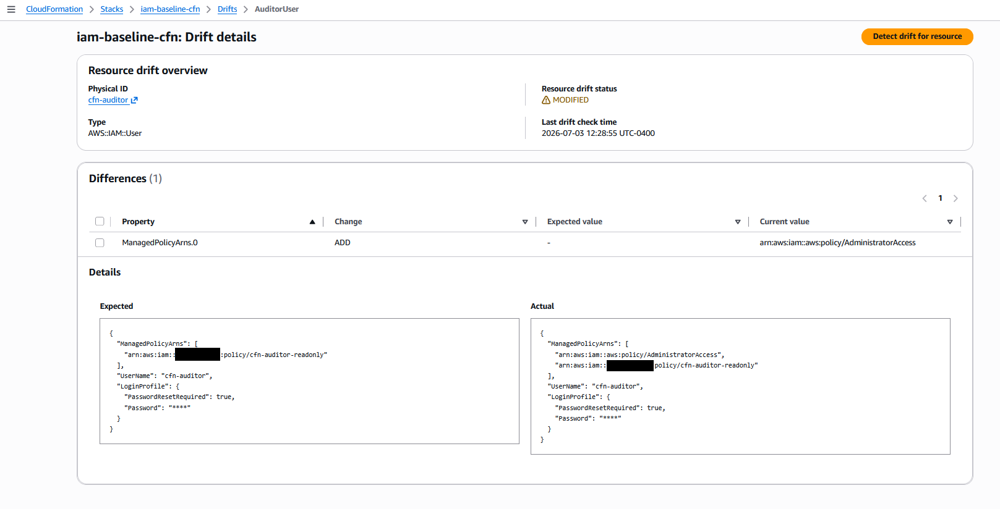

# IAM — GRC Engineering Approach

## What This Does Differently

The same IAM controls from the traditional approach are expressed here as a CloudFormation template: [`cloudformation/iam-baseline.yaml`](cloudformation/iam-baseline.yaml).

A single command deploys the entire IAM baseline to any AWS account:

```bash
aws cloudformation deploy \
  --template-file iam/engineering/cloudformation/iam-baseline.yaml \
  --stack-name iam-baseline \
  --capabilities CAPABILITY_NAMED_IAM \
  --parameter-overrides \
      AuditorPassword=<password> \
      AdminPassword=<password> \
      DevPassword=<password> \
      DevBucketName=<your-real-bucket-name>
```

Total time: under 2 minutes. No console navigation required — deploying via the console produces the same result:



`DevBucketName` defaults to a placeholder (`dev-application-bucket-REPLACE-ME`) — override it with a bucket that actually exists, or the `developer-s3-limited` policy will be scoped to a bucket that doesn't exist and grant no real access.

**For demo purposes only** — passing passwords via `--parameter-overrides` can leak into shell history and CI logs. The parameters are marked `NoEcho: true` so CloudFormation won't display or log the values, but in production these should be sourced from AWS Secrets Manager (or generated and rotated automatically) rather than passed on the command line.

---

## Why This Approach Is Better for GRC

**Repeatable.** The same template produces the same environment every time. New account, same command, same result. This is how you baseline 50 accounts consistently.

**Version-controlled.** Every change to IAM policies goes through a Git commit. The commit history is the change log — who changed what, when, and (via commit message) why. This is auditable in a way console clicks never are.

**Reviewable.** Policy changes can be submitted as pull requests. A second engineer (or an automated linter) reviews the change before it deploys. This is the shift-left model — catching problems before they reach production.

**The template IS the evidence.** An auditor doesn't need a screenshot to confirm these controls exist. The deployed CloudFormation stack is queryable via API. The template in Git is the authoritative record of intended configuration. CloudFormation drift detection flags any out-of-band changes.

**Stakeholder-friendly.** Developers can read YAML. They can propose policy changes via PR without involving the GRC team in a back-and-forth email thread. GRC reviews and approves via the same pull request workflow the engineering team already uses.

---

## Permissions Boundary: Closing the Self-Escalation Gap

The security review of this project found a real gap in `admin-with-guardrails`: it's an identity-based Deny, and an admin with `iam:*` can simply detach or delete that policy from their own user, defeating the guardrails entirely.

The template mitigates this with `AdminPermissionsBoundary`, attached to the admin user via the `PermissionsBoundary` property. A permissions boundary caps the *effective* maximum permissions an identity can have — even if the identity policy allows an action, the boundary must also allow it, or it's denied. This boundary allows everything by default (so normal admin work is unaffected) and specifically denies:

- Detaching or deleting `AdminWithGuardrailsPolicy` from the admin user
- Deleting, modifying, or repointing the default version of `AdminWithGuardrailsPolicy`
- Removing or swapping the permissions boundary itself off the admin user

**This is a real fix, not just documentation** — it was verified by deploying the stack, logging in as the CFN-managed admin user, and attempting to detach the guardrail policy from the console; the action returns an explicit `AccessDenied`, the same control-test pattern used to verify the `auditor-readonly` deny in Project 1.





**Residual gap:** an admin with `iam:*` could still delete the boundary *policy itself* (CloudFormation can't self-reference a resource's own ARN within its own policy document, so that specific denial isn't expressible here without a separate follow-up stack). The complete fix for that is an AWS Organizations Service Control Policy, which is enforced outside the account entirely and can't be self-modified — out of scope for a single-account free-tier setup, but the correct answer at multi-account scale.

---

## Drift Detection: Catching Out-of-Band Changes

CloudFormation can compare a deployed stack's actual state against the template that defines it. If any resource was changed outside of CloudFormation — through the console, CLI, or another automation — drift detection flags it.

Tested by manually attaching the AWS-managed `AdministratorAccess` policy to the CFN-managed auditor user (outside of CloudFormation), then running **Stack actions → Detect drift**:



The diff is precise: `ManagedPolicyArns.0` shows `ADD` with the unauthorized policy ARN as the actual value and nothing expected in its place. In a traditional GRC program, this kind of change would only surface at the next periodic review — weeks or months later, if at all. Here it's detectable on demand, and could be scheduled to run automatically (e.g., via EventBridge + Lambda) for continuous monitoring.

---

## Known Limitation: Password Policy

CloudFormation does not have a native resource for the IAM account-level password policy (`AWS::IAM::AccountPasswordPolicy` does not exist). This is a gap in CloudFormation coverage for account-level settings.

The template documents the intended password policy as metadata. To apply it programmatically, use the AWS CLI:

```bash
aws iam update-account-password-policy \
  --minimum-password-length 14 \
  --require-uppercase-characters \
  --require-lowercase-characters \
  --require-numbers \
  --require-symbols \
  --max-password-age 90 \
  --password-reuse-prevention 24 \
  --allow-users-to-change-password
```

This could be wrapped in a Lambda-backed Custom Resource for full IaC coverage — a natural next step.

---

## Control Mapping

Framework note: CMMC 2.0 Level 2 = all 110 NIST SP 800-171 practices, required for DoD contractors handling CUI. ISO 27017 is the cloud-specific extension of ISO 27001:2022 — both are included because this is an AWS environment.

| Control | CIS Benchmark | SOC 2 | NIST CSF | CMMC 2.0 | ISO 27001:2022 | ISO 27017 |
|---|---|---|---|---|---|---|
| Password policy (14 chars, complexity, 90-day expiry, no reuse) | 1.8–1.11 | CC6.1 | PR.AC-1 | IA.L1-3.5.7, IA.L1-3.5.8 | A.5.17 | Inherits 27001 |
| Least privilege — auditor scoped read-only | 1.16 | CC6.3 | PR.AC-4 | AC.L1-3.1.1, AC.L1-3.1.2 | A.5.15, A.5.18 | CLD.9.2.3 |
| Least privilege — developer scoped to specific S3 bucket ARN | 1.16 | CC6.3 | PR.AC-4 | AC.L1-3.1.1, AC.L1-3.1.2 | A.5.15, A.5.18 | CLD.9.2.3 |
| Separation of duties — auditor cannot modify IAM | 1.16 | CC6.3 | PR.AC-4 | AC.L2-3.1.5 | A.5.3 | CLD.6.3.1 |
| Explicit deny on audit control tampering (admin guardrails)* | 3.2 | CC7.2 | PR.PT-1 | AU.L2-3.3.1 | A.8.15 | CLD.12.4.5 |
| Region lock — admin restricted to us-east-1 | 4.1 | CC6.6 | PR.AC-5 | CM.L2-3.4.6 | A.8.19 | CLD.12.1.5 |
| Permissions boundary prevents admin from self-removing guardrails | 1.16, 3.2 | CC6.3, CC7.2 | PR.AC-4, PR.PT-1 | AC.L2-3.1.5 | A.5.3, A.8.15 | CLD.6.3.1, CLD.12.4.5 |

\* Enforced via an identity-based IAM Deny, not an SCP — see [`../README.md`](../README.md#the-policies) for the known limitation (an admin with `iam:*` could remove this guardrail from their own user).
